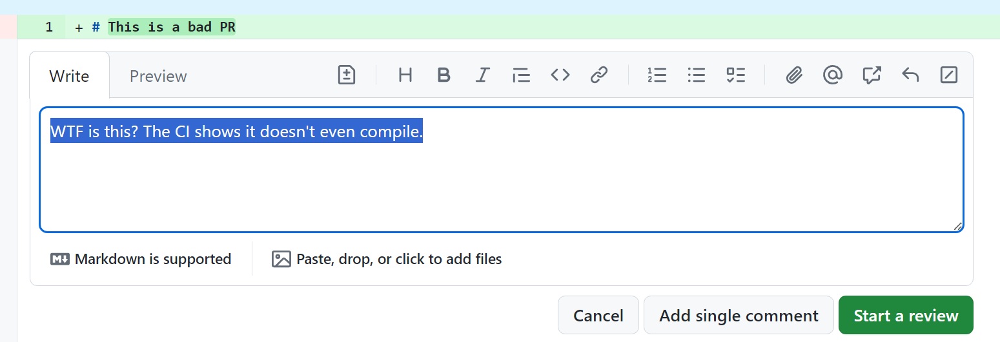
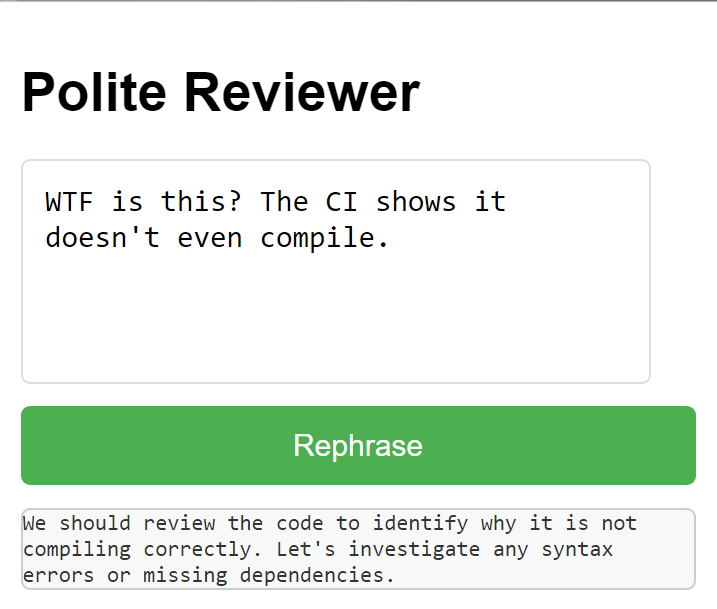

# Polite Reviewer

This is a simple chrome extension that helps you write polite reviews. Select any text in the webpage and click on the extension icon to get a polite version of the selected text.

When to use: If you often find yourself angry in code review, you should use it.

## Installation
Load the extension in developer mode in Chrome.

You will need an OAuth2.0 client ID to use the extension.

## Usage
1. Select any text in the webpage (i.e., your pending code review). 
2. Click on the extension icon and the polite version of the selected text will be displayed. 
3. Click on the polite version to copy it to the clipboard.
